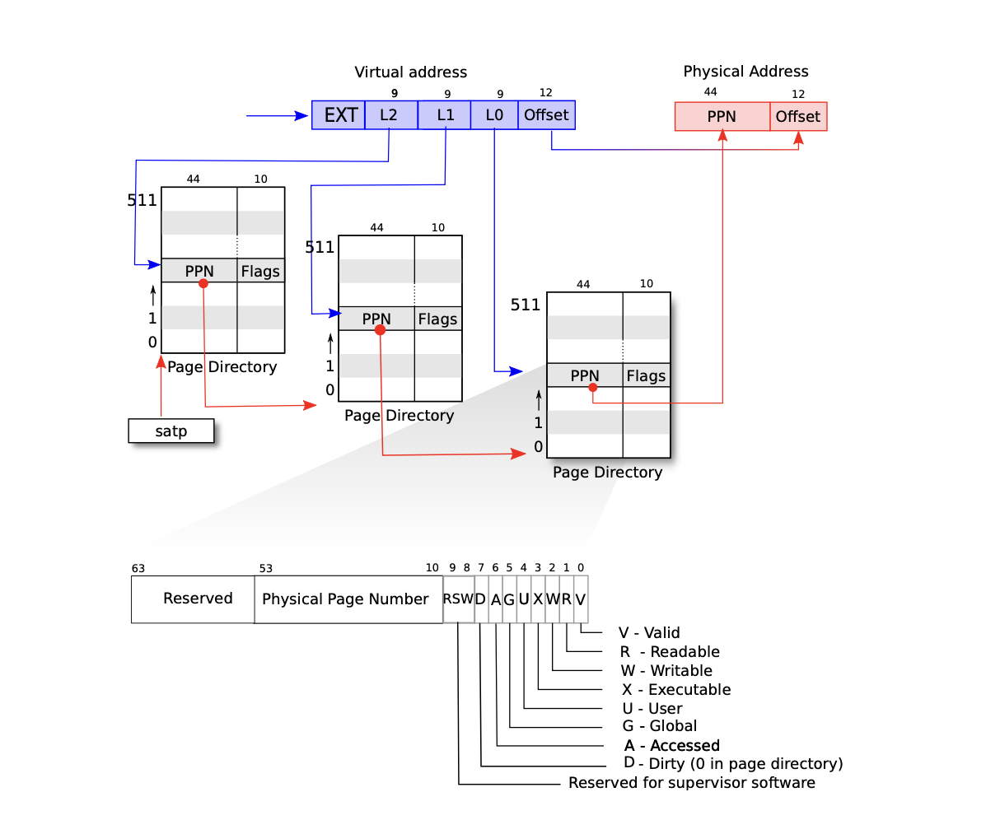
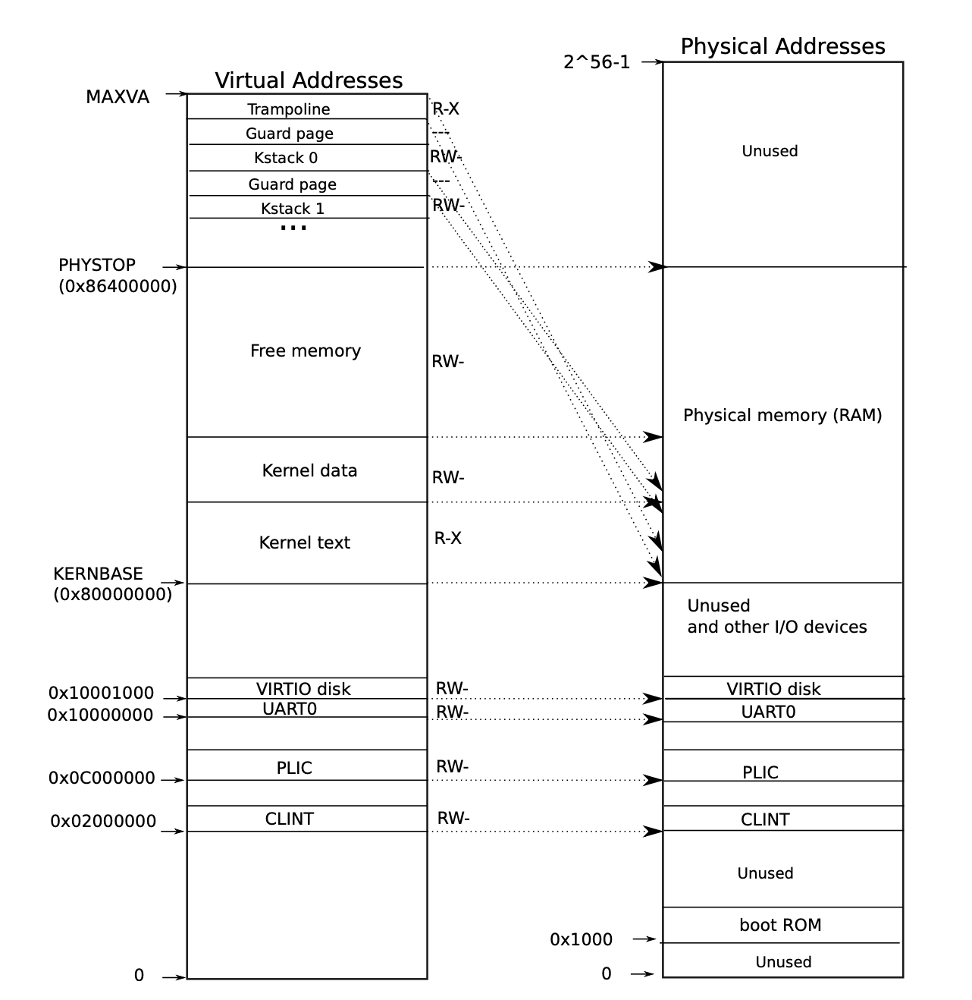
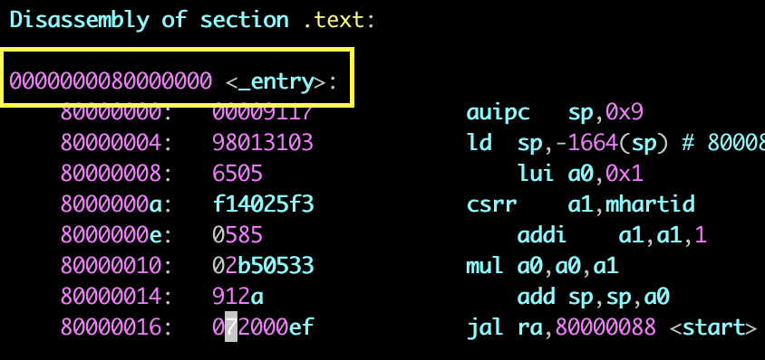
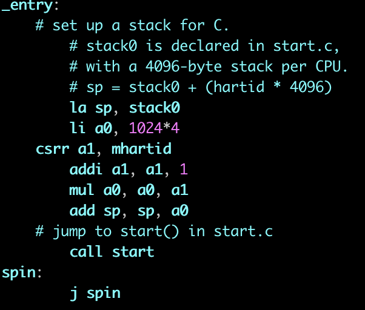

# xv6 pagetable 实现

## 地址转换

- **虚拟地址：** 在 xv6 中使用 39bit 虚拟地址，其中页号 27bit，页内偏移是 12bit（一个 page 4KB）。
- **物理地址：** 物理地址是 56bit，其中页号 44bit，页内偏移量 12 bit。
- **PTE：** Page Table Entries，每个 PTE 由 44bit 的物理页号和 10bit 的flag 组成，其中 flag PTE_V 表示对应的 PTE 是否存在，如果不存在，对这个 page 的访问会造成一个 exception。每个 Page 能放 512 个 PTE。
- **三级页表：** 虚拟地址的 27bit 被分成三个 9bit ，用来在一个 Page 里面 index 一个 PTE。一级页表的地址存放在 satp 寄存器当中。


## 内核地址空间

### 内核虚拟地址空间布局和映射

虚拟地址空间中 0~0x800000000（KERNBASE) 中是预留给 I/O 设备的。内核的虚拟内存和物理内存之间使用 Driect Mapping 的方式，也就是说虚拟内存和物理内存的地址是一样的。在物理地址的分配上，0~KERNBASE 的地址空间是预留给 I/O 设备的，对这些地址上对应设备地址段的访问会访问到对应的 I/O 设备，KERNBASE 到 PHYSTOP 是 DRAM 的物理地址。


## 代码实现

RISC-V 启动之后，会从一块只读内存中读取并执行 boot loader 程序，boot loader 会把系统内核 load 到内存中（物理地址 KERNBASE)。CPU 从 _entry 开始执行 xv6。_entry 的地址就是 KERNBASE。

_entry 本身是一段汇编代码：
la 指令把 stack0 的地址加载到寄存器 sp 中，li 指令把把 4096 加载到寄存器 a0 中。mhartid 寄存器中保存的是当前运行程序的 CPU 核心的编号（从 0 开始编号），csrr 把这个编号存到寄存器 a1 中。addi 把 a1 中存储的编号加 1。mul 指令把 a0 乘上 a1 再赋值给 a0。add 指令把 sp 的值赋值为 sp + a0。这样 sp 就是对应于这个 CPU 核心的栈顶指针。最后调用 start。

start 函数里面，首先把运行的模式从 machine mode 改成了 supervisor mode，然后通过把 satp 寄存器赋值为 0 关闭分页，进行一些初始化操作后就跳到 main 函数开始执行。

```c
    kinit();         // physical page allocator
    kvminit();       // create kernel page table
    kvminithart();   // turn on paging
    procinit();      // process table
    ......
    user_init();     // first user process
```

### kinit()

kinit() 主要做的工作就是把从 kernel 占用的内存之后到 PHYSTOP 的内存分页，把每一页用链表串起来

```c
extern char end[]; // first address after kernel.
                   // defined by kernel.ld.

struct run {
  struct run *next;
};

// 用这个数据结构来把所有的空闲页串起来
struct {
  struct spinlock lock;
  struct run *freelist;
} kmem;

void
kinit()
{
  initlock(&kmem.lock, "kmem");
  // 从 Kernal 占用的物理内存到 PHYSTOP 的物理内存
  freerange(end, (void*)PHYSTOP);
}

void
freerange(void *pa_start, void *pa_end)
{
  char *p;
  // PGROUNDUP 做一个 ROUNDUP，保证起始地址是 PAGESIZE 的整数倍（对齐）
  // 如果没有对齐的话 PTE 是没办法实现的（虚拟内存页面和物理内存页面无法对齐）
  p = (char*)PGROUNDUP((uint64)pa_start);
  // 把从 kernel 结束到 PHYSTOP 的所有空闲内存分页并且用链表串起来
  for(; p + PGSIZE <= (char*)pa_end; p += PGSIZE)
    kfree(p);
}

// Free the page of physical memory pointed at by v,
// which normally should have been returned by a
// call to kalloc().  (The exception is when
// initializing the allocator; see kinit above.)
void
kfree(void *pa)
{
  struct run *r;

  if(((uint64)pa % PGSIZE) != 0 || (char*)pa < end || (uint64)pa >= PHYSTOP)
    panic("kfree");

  // Fill with junk to catch dangling refs.
memset(pa, 1, PGSIZE);

  r = (struct run*)pa;

  acquire(&kmem.lock);
  r->next = kmem.freelist;
  kmem.freelist = r;
  release(&kmem.lock);
}

// Allocate one 4096-byte page of physical memory.
// Returns a pointer that the kernel can use.
// Returns 0 if the memory cannot be allocated.
void *
kalloc(void)
{
  struct run *r;

  // kalloc 分配内存就是从空闲页链表中取出一页分配出去
  acquire(&kmem.lock);
  r = kmem.freelist;
  if(r)
    kmem.freelist = r->next;
  release(&kmem.lock);

  if(r)
    memset((char*)r, 5, PGSIZE); // fill with junk
  return (void*)r;
}
```

### kvminit()

```c
/*
 * the kernel's page table.
 */
pagetable_t kernel_pagetable;

/*
 * create a direct-map page table for the kernel.
 */
void
kvminit()
{
  // 分配一页，作为三级页表的 root pagetable
  kernel_pagetable = (pagetable_t) kalloc();
  memset(kernel_pagetable, 0, PGSIZE);

  // 把这些 I/O 设备的地址映射到内核 pagetbale 中
  // uart registers
  kvmmap(UART0, UART0, PGSIZE, PTE_R | PTE_W);

  // virtio mmio disk interface
  kvmmap(VIRTIO0, VIRTIO0, PGSIZE, PTE_R | PTE_W);

  // CLINT
  kvmmap(CLINT, CLINT, 0x10000, PTE_R | PTE_W);

  // PLIC
  kvmmap(PLIC, PLIC, 0x400000, PTE_R | PTE_W);

  // map kernel text executable and read-only.
  kvmmap(KERNBASE, KERNBASE, (uint64)etext-KERNBASE, PTE_R | PTE_X);

  // map kernel data and the physical RAM we'll make use of.
  kvmmap((uint64)etext, (uint64)etext, PHYSTOP-(uint64)etext, PTE_R | PTE_W);

  // Trampoline 是用来处理中断的
  // map the trampoline for trap entry/exit to
  // the highest virtual address in the kernel.
  kvmmap(TRAMPOLINE, (uint64)trampoline, PGSIZE, PTE_R | PTE_X);
}

// add a mapping to the kernel page table.
// only used when booting.
// does not flush TLB or enable paging.
void
kvmmap(uint64 va, uint64 pa, uint64 sz, int perm)
{
  if(mappages(kernel_pagetable, va, sz, pa, perm) != 0)
    panic("kvmmap");
}

// Create PTEs for virtual addresses starting at va that refer to
// physical addresses starting at pa. va and size might not
// be page-aligned. Returns 0 on success, -1 if walk() couldn't
// allocate a needed page-table page.
int
mappages(pagetable_t pagetable, uint64 va, uint64 size, uint64 pa, int perm)
{
  uint64 a, last;
  pte_t *pte;

  a = PGROUNDDOWN(va);
  last = PGROUNDDOWN(va + size - 1);
  for(;;){
    if((pte = walk(pagetable, a, 1)) == 0)
      return -1;
    if(*pte & PTE_V)
      panic("remap");
    // 设置最后一级 PTE，使它指向 pa 对应的页号
    *pte = PA2PTE(pa) | perm | PTE_V;
    // 如果还没分配完足够的页
    if(a == last)
      break;
    a += PGSIZE;
    pa += PGSIZE;
  }
  return 0;
}

// Return the address of the PTE in page table pagetable
// that corresponds to virtual address va.  If alloc!=0,
// create any required page-table pages.
//
// The risc-v Sv39 scheme has three levels of page-table
// pages. A page-table page contains 512 64-bit PTEs.
// A 64-bit virtual address is split into five fields:
//   39..63 -- must be zero.
//   30..38 -- 9 bits of level-2 index.
//   21..29 -- 9 bits of level-1 index.
//   12..20 -- 9 bits of level-0 index.
//    0..11 -- 12 bits of byte offset within the page.
pte_t *
walk(pagetable_t pagetable, uint64 va, int alloc)
{
  if(va >= MAXVA)
    panic("walk");

  for(int level = 2; level > 0; level--) {
    // PX 是个预定义宏，把对应的 level 的 9bit 取出来
    // 然后把 pagetable 指向的 page 中对应 index 的 PTE 取出来
    pte_t *pte = &pagetable[PX(level, va)];
    // 这个 PTE 是否 valid
    if(*pte & PTE_V) {
      // 如果 valid
      // 获取到下一级的 PPN（Physical Page Number）
      pagetable = (pagetable_t)PTE2PA(*pte);
    } else {
      // 分配新的页
      if(!alloc || (pagetable = (pde_t*)kalloc()) == 0)
        return 0;
      memset(pagetable, 0, PGSIZE);
      // 在那个 PTE 中写入新页的页号并且设置为 valid
      *pte = PA2PTE(pagetable) | PTE_V;
    }
  }
  // 返回最后一级页表中的 PTE 指针
  return &pagetable[PX(0, va)];
}
```

### kinithart()

在执行完 kinithart() 之后，系统开始进行地址翻译

```c
// Switch h/w page table register to the kernel's page table,
// and enable paging.
void
kvminithart()
{
  // 设置 satp 寄存器指向 kernel pagetable
  w_satp(MAKE_SATP(kernel_pagetable));
  // 刷新 TLB
  sfence_vma();
}
```

### procinit()

```c
// initialize the proc table at boot time.
void
procinit(void)
{
  struct proc *p;

  initlock(&pid_lock, "nextpid");
  for(p = proc; p < &proc[NPROC]; p++) {
      initlock(&p->lock, "proc");

      // Allocate a page for the process's kernel stack.
      // Map it high in memory, followed by an invalid
      // guard page.
      char *pa = kalloc();
      if(pa == 0)
        panic("kalloc");
      // 栈被分配在内核虚存中的高地址，每个 stack 下面有一个 guard page
      // guard page 的 PTE_V 都没有设置，可以在一定程度上防止栈溢出
      uint64 va = KSTACK((int) (p - proc));
      kvmmap(va, (uint64)pa, PGSIZE, PTE_R | PTE_W);
      // 保存指向 kstack 的指针
      p->kstack = va;
  }
  // 刷新 pagetable
  kvminithart();
}
```

### userinit()

```c
// Set up first user process.
void
userinit(void)
{
  struct proc *p;

  p = allocproc();
  initproc = p;

  // allocate one user page and copy init's instructions
  // and data into it.
  // initcode 执行的是 exec("/init");
  uvminit(p->pagetable, initcode, sizeof(initcode));
  p->sz = PGSIZE;
  // prepare for the very first "return" from kernel to user.
  p->trapframe->epc = 0;      // user program counter
  p->trapframe->sp = PGSIZE;  // user stack pointer

  safestrcpy(p->name, "initcode", sizeof(p->name));
  p->cwd = namei("/");

  p->state = RUNNABLE;

  release(&p->lock);
}
```